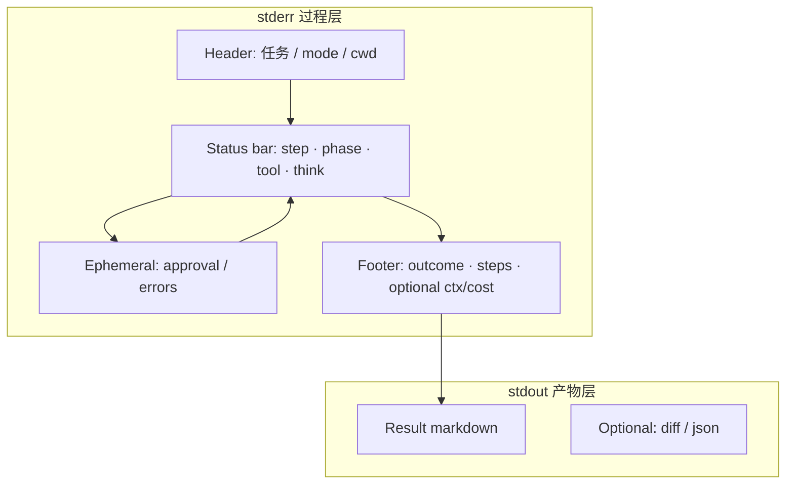

# CLI 展示与 TUI 架构

> layer: **architecture / domains / cli**  
> audience: agent（修改 `apps/cli/src/ui/`、`apps/cli/src/tui/`、终端输出时读）  
> 上级索引：[architecture/README.md](../README.md)  
> 用户用法见 [user-guide.md](../../user-guide.md)

---

## A. 终端披露规范（L0–L4）

## 1. 设计原则

| 原则 | 说明 |
|------|------|
| **stdout = 产物** | 最终回答、diff、JSON 结果 — 可被 `>` pipe |
| **stderr = 过程** | 进度、状态、审批提示 — 不污染 pipe |
| **TTY 与 pipe 分流** | TTY：单行 `\r` 刷新或 spinner；非 TTY：最少行数或静默 |
| **层级披露** | 默认隐藏实现细节；`--verbose` / `--trace` 逐层展开 |
| **一步一焦点** | 同一时刻只突出「当前在干什么」，历史折叠 |

### 1.1 披露层级

| 层级 | 名称 | 典型场景 | 开关 |
|------|------|----------|------|
| **L0** | quiet | `code-mind run` 默认 | （默认） |
| **L1** | normal | REPL、交互续聊 | REPL 默认 |
| **L2** | verbose | 调试 step / tool | `--verbose` |
| **L3** | trace | token、context、audit | `--trace` |
| **L4** | debug | 完整 RuntimeEvent 流 | `--debug` |

---

## 2. 输出通道

```text
stderr  ─  Header（任务 / mode / cwd）
         Status bar（step · phase · tool · think）← TTY 下单行刷新
         Ephemeral（approval、错误、compaction 提示）
         Footer（✓ outcome · steps · 可选 ctx/cost）

stdout  ─  Result（markdown 正文）
         Optional（--diff、--json）
```

### 2.1 TTY vs 非 TTY

| 行为 | TTY | pipe / CI |
|------|-----|-----------|
| Status bar | `\r` 原地刷新 | 不刷新；L0 可完全省略 |
| Spinner | 可用 | 不用；最多一行文字 |
| 颜色 | 遵循 `NO_COLOR` / `FORCE_COLOR` | 默认无色 |
| Approval | 交互 prompt | 应 fail-fast 或需 `--yes` |

### 2.2 模式矩阵

| 场景 | 默认层级 | 特点 |
|------|----------|------|
| `code-mind run` | L0 | 一次任务，pipe 友好 |
| REPL | L1 | 多轮；可 `/verbose` 切换 |
| `session resume` / `-c` | L1 | 显示 `continuing session_…` |
| `--json` | 机器可读 | **零 stderr 进度**；stdout 一条 JSON |
| `--verbose` | L2 | 逐步 step / tool 日志 |
| `--trace` | L3 | context / token / preview |
| `--debug` | L4 | 完整事件流（`renderRuntimeEventLine`） |

---

## 3. 核心数据类型

### 3.1 Think（模型推理）

**数据来源：** `model.request`、`model.response`、`model.reasoning.delta`；`textPreview` / `plannedToolCalls`。

**语义（journal v3 三层）：**

| 层 | 含义 | 显示位置 |
|----|------|----------|
| **Narrative** | 模型自然语言意图 | 活动窗上方，每 step 一句 |
| **Activity log** | 工具调用 + 参数 + 状态 | 固定高度活动窗（TTY 8 行） |
| **Reasoning** | DeepSeek chain-of-thought | L1 一行 `(N chars)`；L3 `--trace` 展开 |

| 层级 | TTY | 非 TTY |
|------|-----|--------|
| L0–L1 | narrative + 活动窗 + 阶段结论 | 同结构，活动窗不限高、无 border |
| L2+ | + verbose 完整 tool 块 + 事件行 | 同左 |

**不应做：**

- 不要把 thinking 全文当 stdout 结果（streaming 除外，见 §3.1.1）。
- L0–L1 不再使用单行 status bar 作为主进度。

#### 3.1.1 Streaming（REPL / 未来）

```text
# stderr（narrative + 活动窗）
我将分析项目…
──────────────────
thinking…
list_dir  .
──────────────────

# stdout（逐 token）
## 项目概述
这是一个 local-first…
```

边界：**第一个面向用户的 markdown 段落**开始写 stdout；活动窗留在 stderr。

---

### 3.2 Step（推理步 / 生命周期）

**数据来源：** `step.started`、`model.response`、`tool.call`、`tool.result`、`turn.finished`。

**语义：** 每个 model step = **意图 → 活动窗 → 阶段结论**（有后续 tool 时）。

| 层级 | 显示 |
|------|------|
| L0–L1 | **journal v3**：narrative + 活动窗 + 结论/折叠 |
| L2 | + verbose 事件行 + 完整 tool 块 |
| L3 | + ctx/token/耗时 trace |

#### Journal v3（当前默认 L0/L1 实现）

```text
我将阅读整个项目，定位 bug 相关代码…

────────────────────────────────────────
list_dir   .
read_file  packages/core/foo.ts  …
grep       "handleTool"  path=src
────────────────────────────────────────

结论：已定位入口文件，下一步运行测试…

▸ Step 2 · 3 tools
```

规则：

- 一行 = 一次工具调用；参数人类可读；pending / done / failed 同一行更新
- TTY：活动窗固定 8 行，超出滚动；原地重绘
- pipe：顺序输出全量 tool 行（无 border）
- REPL `/expand`：展开最近折叠的 step 或最近 shell 输出

#### Turn 边界

| 事件 | L0–L1 | L2 |
|------|-------|-----|
| `turn_started` | header 已含 mode/model | + debug 行 |
| `turn_finished` | stderr 一行：`✓ 5 steps · success` | + completion metadata |

---

### 3.3 Context 大小

**数据来源（现状）：**

- `ModelResponse.usage` → `TokenUsage`（input / output / total）
- `model_call_started.messageCount`
- audit `context_compact`（compaction 路径与次数）
- `ContextSnapshot`（构建时 messages 体量）

**现状缺口：** token / compaction **尚未作为一等 `RuntimeEvent` 暴露给 CLI**；规范先定显示，runtime 后续补事件。

**语义：** 成本与容量信号 —— 默认用户不关心；长 session / 调试时需要。

| 层级 | 何时显示 | 格式示例 |
|------|----------|----------|
| L0 | 不显示 | — |
| L1 | 不显示 | — |
| L2 | compaction 发生时 | `context compacted · 3 blocks → summary` |
| L3 | 每次 model call 后 | `ctx 42k/128k · in 38k out 1.2k` |
| REPL `/context` | 按需 | 表格：messages 数、估算 token、compact 次数 |

#### 三种 context 指标（分开语义）

| 指标 | 含义 |
|------|------|
| **prompt size** | 本次发给模型的上下文（input tokens 或估算） |
| **window usage** | 占 model `maxContextTokens` 的百分比 |
| **compaction** | 是否触发压缩、累计压缩轮数 |

L2+ footer 示例：

```text
context 38.2k / 128k (30%) · compact ×1 · ~$0.002
```

L0 run：**不出现在 stdout**；可选在 `turn_finished` 后 stderr 一行附带 `38k ctx`（类似 Claude Code `/cost` 极简风格）。

---

### 3.4 Result（最终结果）

**数据来源：** `AgentResult.summary ?? finalText`；`status` / `effectiveStatus`；`metadata.modifiedFiles`、`verification` 等。

**语义：** 用户主目标 —— **独占 stdout（L0）**。

| 层级 | stdout | stderr |
|------|--------|--------|
| L0 | **仅正文**（markdown） | `✓ success · 5 steps` |
| L1 | 正文 + 末尾 dim 一行 meta | 同上 |
| L2 | 正文 + footer（session / steps / model） | 过程日志 |
| `--json` | 结构化 JSON（含 sessionId、metadata） | 无 |

#### L0 理想输出

```text
# stderr
code-mind · edit › explain this repo
~/workspace/agent-study/code-mind
⠋ step 5/12 · summarizing
✓ 5 steps · success

# stdout
## code-mind 项目概述
这是一个 **local-first code agent** …
```

#### 按结果类型分支

| 类型 | stdout 主内容 | stderr 补充 |
|------|---------------|-------------|
| ask / 纯分析 | markdown 回答 | — |
| edit 有改动 | 回答；diff 仅 `--diff` 时 | `3 files changed` |
| plan | plan markdown | `plan ready · N steps estimated` |
| failed | 错误说明 + 已有 partial | `✕ failed · permission_denied` |
| stopped_by_limit | partial 回答 | `⚠ stopped · 12/12 steps` |

**禁止（L0）：** `Task:` / `Summary:` 标签式 dump；session id 默认不进 stdout。

---

## 4. 其他显示面

### 4.1 Phase（任务阶段）

阶段：`intake` → `exploring` → `editing` → `verifying` → `summarizing`

- L0–L1：只在 status bar 里一个词（如 `exploring`）
- L2：phase 变化可单独一行 `phase → exploring`
- 不要每变一次 phase 就换行（L0）

### 4.2 Tool 调用

| 层级 | 显示 |
|------|------|
| L0 | 工具完成单行：`✓ Read README.md` / `✓ Listed .` |
| L1 | 同 L0 语义发现行；失败时分层 `Command failed` / `File not found` |
| L2 | 完整块：`Run` / `Read` / `Search` / `Edit` + diff 预览 |
| L3 | + token / ctx trace 行 |
| L4 | 全部原始 `RuntimeEvent` 调试行 |

### 4.3 Approval（审批）

**不可折叠** —— 必须打断 status bar，独占交互区：

```text
Approval required / High-risk approval required
  Action / Reason / Risk
  Allow?
  [y] yes, once  [a] always allow  [n] no  [e] explain
```

REPL：审批块显示 `Reply at prompt ›`；在主 prompt 输入 `y`/`a`/`n`/`e`，或使用 `/approve`、`/approve-always`、`/deny`。`always allow` 在当前 session 内持久化（内存 allowlist）。不再重复打印 JSON 格式审批 dump。

### 4.4 Verification

| 层级 | 显示 |
|------|------|
| L0 | status bar：`verifying…`；失败 stderr 一行 |
| L2 | `verification started` / `passed` / `failed: …` |

### 4.5 Plan-first（`--plan`）

两阶段视觉分离：

```text
── plan ──────────────────
(plan markdown 或 stderr 摘要)
── execute ───────────────
(正常 run 流程)
```

L0：plan 阶段 stderr `planning…`；plan 结果默认 stdout 第一段，或 `--plan-only` 时 stdout 仅 plan。

### 4.6 Mode / Model / Session

| 信息 | L0 | 位置 |
|------|----|------|
| mode | header 一次 | stderr |
| model | header 或 footer | stderr |
| session id | 不显示 | L2 footer 或 `--json` |
| cwd | header dim 一行 | stderr |

REPL prompt 示例：`code-mind:edit:deepseek › `

### 4.7 错误与中断

统一 stderr，不污染 stdout：

```text
✕ tool failed · shell · exit 127
✕ permission_denied · apply_patch
⚠ cancelled
```

`Ctrl+C`：清除 status bar → `cancelled` → stdout 空或 partial。

### 4.8 改动摘要（edit 模式）

- L0：默认不展示 diff
- 结束 stderr 可选：`✓ success · 5 steps · 2 files changed`
- `code-mind run … --diff` 或 REPL `/diff` 才把 patch 写 stdout

### 4.9 Cost / Token 汇总

- REPL：`/cost` 按需
- run L0：不显示
- L3 footer：`in 45.2k · out 3.1k · ~$0.008 · deepseek`

### 4.10 JSON / CI

`--json`：零 stderr 进度；stdout 单条 JSON；适合脚本与 CI。

---

## 5. 信息流总览



---

## 6. 实现状态（2026-05）

| 能力 | 状态 |
|------|------|
| L0–L1 journal v3（narrative + 活动窗 + 结论） | **已实现** |
| L0/L1 工具参数单行（`tool-call-line.ts`） | **已实现** |
| TTY 固定高度活动窗 + 原地重绘 | **已实现** |
| Step 折叠 + REPL `/expand` | **已实现** |
| L0 stderr footer `✓ N steps · status` | **已实现** |
| Security header（Sandbox/Approval/Network） | **已实现** (L1+) |
| Implemented / Validation / Next 尾注 | **已实现** (L1+) |
| 结构化 JSON（files_changed/commands/validation） | **已实现** |
| 分层错误块（Command failed / File not found） | **已实现** (L1+ 失败) |
| `--debug` L4 事件流 | **已实现** |
| REPL `/diff` `/context` `/cost` `/tools` `/permissions` `/expand` `/reason` | **已实现** |
| REPL 轻量默认 UI（status bar + Activity latest + thinking 行） | **已实现**（`repl-display.ts`） |
| REPL Activity/Context 面板 | **已实现**（`/status`；默认 turn 结束改为 Hints） |
| `code-mind run` TTY 审批 prompt | **已实现** (`CliPermissionPrompter`) |
| Plan 编号步骤格式化 | **已实现** (`plan-format.ts`) |
| 工具结果语义发现（Found package.json 等） | **已实现** (`tool-findings.ts`，L2+ / 遗留) |
| `code-mind --tui` 单列主视图 + 按需 overlay | **已实现**（`apps/cli/src/tui/`；见本文 §B） |
| 旧版 TUI 永久右侧 THINKING 分栏 | **已移除** |
| Step 内 LLM 自由文本发现 | 未实现 |

---

## 7. Runtime 待补数据（实现 checklist）

实现 L2+ / L3 时，建议在 `RuntimeEvent` 或 turn 汇总中补充：

| 字段 | 用途 | 优先级 |
|------|------|--------|
| `contextTokens` / `maxContextTokens` | status bar、footer | P1 |
| `tokenUsage` 累计 | `/cost`、L3 footer | P1 |
| `context_compact` 事件 | L2 compaction 一行 | P2 |
| `modelCallDurationMs` | L3 trace | P2 |
| `toolCallDurationMs` | L3 trace | P2 |
| `modifiedFiles` 计数 | edit 结束 stderr | P1 |

---

## 8. 命令与 REPL 对照

| 入口 | 层级 | 说明 |
|------|------|------|
| `code-mind run …` | L0 | 见 [user-guide §5](../../user-guide.md#5-运行任务) |
| `code-mind run … --verbose` | L2 | 逐步日志 + 完整 footer |
| `code-mind run … --trace` | L3 | token/context 追踪 |
| `code-mind run … --debug` | L4 | 完整 RuntimeEvent 流 |
| `code-mind run … --json` | JSON | 结构化结果；stderr 无进度 |
| REPL `/verbose` | L1↔L2 | 切换逐步日志 |
| REPL `/context` `/cost` `/diff` `/tools` `/permissions` `/expand` `/reason` | 按需 | **已实现** |

---

## 9. 参考

- 用法与命令：[user-guide.md](../../user-guide.md)
- 运行时事件定义：`packages/shared/src/types.ts` → `RuntimeEvent`
- CLI 渲染实现：`apps/cli/src/ui/progress-printer.ts`、`agent-output/step-journal.ts`、`agent-output/activity-pane.ts`、`agent-output/tool-call-line.ts`

**风格取向：** 默认 **Claude Code 极简**（L0 单行 status + stdout 纯正文）；调试时 **OpenCode 结构化进度**（L2 verbose）。


---

## B. TUI 布局与交互

## 1. 设计原则

TUI 默认不做“监控大屏”，而是做一个轻量、可持续交互的 code agent 工作台。

默认只回答用户最关心的几个问题：

1. 当前任务是什么？
2. Agent 计划怎么做？
3. 现在执行到哪一步？
4. 最近发生了什么？
5. 需要我输入、审批或展开什么？

信息层级：

```text
默认主视图
  只显示当前任务、计划、最近活动、输入框。

选中展开
  查看 thinking、tool result、diff、error。

slash command
  查看 status、context、permissions、reasoning summary。

verbose / trace
  查看完整工具结果、token、ctx、耗时、事件流。
```

一句话原则：

```text
默认界面保持轻；thinking 流动显示；详细信息通过 Enter 或 slash command 展开。
```

---

## 2. 默认 TUI 主布局

```text
┌──────────────────────────────────────────────────────────────────────────────┐
│ code-mind   mode: edit   model: deepseek   git: main clean   step 4/6  ● run │
├──────────────────────────────────────────────────────────────────────────────┤
│                                                                              │
│ user                                                                         │
│   fix failing parser tests                                                   │
│                                                                              │
│ assistant                                                                    │
│   I’ll reproduce the failure, inspect the parser, patch the smallest safe     │
│   fix, and run focused validation.                                            │
│                                                                              │
│ Plan                                                                         │
│   ✓ 1. Locate test command                                                    │
│   ✓ 2. Reproduce failure                                                      │
│   ✓ 3. Inspect failing module                                                 │
│   → 4. Reason about root cause                                                │
│   · 5. Patch smallest safe fix                                                │
│   · 6. Run focused validation                                                 │
│                                                                              │
│ Activity                                                                     │
│   ✓ read_file      package.json                              12ms             │
│   × run_shell      pnpm test                                 exit 1 · 8.2s    │
│   ✓ read_file      src/utils/parser.ts                       9ms              │
│ > … thinking      comparing expected vs actual behavior       [enter expand] │
│                                                                              │
│   … 3 more events ›                                                          │
│                                                                              │
│ Hints: /status  /diff  /reason  /permissions  /model  /help                  │
│                                                                              │
├──────────────────────────────────────────────────────────────────────────────┤
│ › Type a task or command...                                                   │
└──────────────────────────────────────────────────────────────────────────────┘
```

---

## 3. 默认保留区域

默认只显示 5 个区域：

```text
Top Status
Conversation
Plan
Activity
Input Composer
```

不默认显示：

```text
Context 面板
Tokens
完整工具结果
完整 reasoning
右侧说明栏
Shortcuts 大表格
Live stdout 大窗口
```

这些内容通过命令、选中展开或 verbose 模式查看。

---

## 4. Thinking 流动显示

Thinking 是 Activity 里的特殊行，而不是独立大面板。

默认显示为：

```text
Activity
  ✓ read_file      package.json                    12ms
  × run_shell      pnpm test                       exit 1 · 8.2s
  ✓ read_file      src/utils/parser.ts             9ms
> … thinking       comparing expected vs actual behavior       [enter expand]
```

Thinking 状态可以实时变化：

```text
… thinking · reading failure output
… thinking · comparing expected vs actual behavior
… thinking · forming hypothesis
… thinking · checking smallest safe fix
```

默认不展示完整推理链，只显示当前思考阶段。

---

## 5. Thinking 展开态

用户选中 thinking 行并按 Enter：

```text
┌─ Thinking ───────────────────────────────────────────────────────────────────┐
│ Current focus                                                                │
│   Comparing parser behavior with the failing test expectation.               │
│                                                                              │
│ Hypothesis                                                                   │
│   Empty input and nullish input are handled inconsistently.                   │
│                                                                              │
│ Next action                                                                  │
│   Check whether a narrow guard before tokenization is enough.                 │
│                                                                              │
│ Actions                                                                      │
│   r reason summary   e evidence   q close                                    │
└──────────────────────────────────────────────────────────────────────────────┘
```

说明：

- 这是轻量展开。
- 不展示完整原始 thinking。
- 展示用户可理解的当前焦点、假设和下一步。

---

## 6. Reasoning Summary 展开态

输入 `/reason`，或在 Thinking 展开态按 `r`：

```text
┌─ Reasoning Summary · step 4 ─────────────────────────────────────────────────┐
│ Hypothesis                                                                   │
│   Empty input and null input are handled inconsistently.                      │
│                                                                              │
│ Evidence                                                                     │
│   - Failing test expects an empty token list.                                 │
│   - Current implementation throws before tokenization.                        │
│   - No related tests require throwing for nullish input.                      │
│                                                                              │
│ Decision                                                                     │
│   Add a narrow nullish guard before tokenization.                             │
│                                                                              │
│ Alternative considered                                                       │
│   Change the test expectation.                                                │
│   Rejected because behavior would be inconsistent with nearby cases.          │
│                                                                              │
│ q close   e evidence   d diff                                                │
└──────────────────────────────────────────────────────────────────────────────┘
```

命名建议：

```text
推荐：Reasoning Summary / 推理摘要 / 决策依据 / 分析摘要
不推荐：Full Thinking / Detailed Chain of Thought
```

产品原则：

```text
默认显示 thinking 状态；
展开显示可审计的推理摘要；
不默认暴露完整原始推理链。
```

---

## 7. Diff 展开态

输入 `/diff`：

```text
┌─ Diff · 1 file changed ──────────────────────────────────────────────────────┐
│ src/utils/parser.ts                                                          │
│                                                                              │
│ @@ -42,6 +42,9 @@ export function parse(input: string | null | undefined) {   │
│ -  if (input == null) {                                                       │
│ -    throw new Error("input required");                                       │
│ -  }                                                                         │
│ +  if (input == null) {                                                       │
│ +    return [];                                                              │
│ +  }                                                                         │
│                                                                              │
│ q close   a accept   r revert   o open file                                  │
└──────────────────────────────────────────────────────────────────────────────┘
```

---

## 8. Status 展开态

输入 `/status`：

```text
┌─ Status ─────────────────────────────────────────────────────────────────────┐
│ Task           fix failing parser tests                                      │
│ Mode           edit                                                          │
│ Model          deepseek                                                      │
│ Workspace      ~/workspace/agent-study/code-mind                             │
│ Git            main clean                                                    │
│ Step           4 / 6                                                         │
│ Status         running                                                       │
│ Files read     3                                                             │
│ Files changed  0                                                             │
│ Commands run   1                                                             │
│ Permissions    files rw · commands ask · network off                         │
│                                                                              │
│ q close                                                                      │
└──────────────────────────────────────────────────────────────────────────────┘
```

---

## 9. Approval 弹层

当需要审批时，主界面不应被完全刷掉，而是显示一个居中的 modal：

```text
┌─ Approval required ──────────────────────────────────────────────────────────┐
│ Agent wants to run                                                           │
│   pnpm install                                                               │
│                                                                              │
│ Purpose                                                                      │
│   Install dependencies required to run tests.                                 │
│                                                                              │
│ Risk                                                                         │
│   - Downloads packages from the network.                                      │
│   - May update lockfile.                                                      │
│   - May execute package lifecycle scripts.                                    │
│                                                                              │
│ Options                                                                      │
│   y allow once    a always allow this kind    n deny    e explain             │
└──────────────────────────────────────────────────────────────────────────────┘
```

底部输入区变成：

```text
approval required ›
```

---

## 10. 错误提示

错误不要占大面积，默认显示紧凑卡片：

```text
┌─ Command failed ─────────────────────────────────────────────────────────────┐
│ pnpm test                                                                    │
│ exit code: 1                                                                 │
│                                                                              │
│ Hint                                                                         │
│   Parser tests failed. Use /expand to see output or continue debugging.       │
└──────────────────────────────────────────────────────────────────────────────┘
```

文件不存在：

```text
┌─ File not found ─────────────────────────────────────────────────────────────┐
│ src/missing.ts                                                               │
│                                                                              │
│ Hint                                                                         │
│   The referenced file does not exist. Use /context or continue inspection.    │
└──────────────────────────────────────────────────────────────────────────────┘
```

---

## 11. 键盘交互

```text
↑ / ↓       选择 activity / plan item
Enter       展开当前选中项
q           关闭展开面板
/           输入命令
Tab         补全命令
Ctrl+C      中断当前操作
Ctrl+L      清屏
```

---

## 12. 常用命令

```text
/status        查看当前状态
/context       查看上下文、文件、tokens
/diff          查看文件变更
/reason        查看推理摘要
/expand        展开最近事件
/permissions   查看权限策略
/model         切换或查看模型
/approvals     查看审批历史
/verbose       切换详细模式
/help          查看帮助
```

---

## 13. 输入样式

### 普通自然语言输入

```text
› fix failing parser tests
```

### Slash command

```text
› /status
› /diff
› /reason
```

### 多行任务输入，可选

```text
› /edit-task
# Task
Fix failing parser tests.

# Goal
All parser tests pass.

# Constraints
- Keep fix minimal.
- Do not change public API.
- Ask before broad test suites.
```

---

## 14. Verbose / Trace 分层

### 默认模式

显示：

```text
任务
计划
最近活动
thinking 当前状态
输入框
```

### `/verbose`

额外显示：

```text
完整工具行
工具结果摘要
reasoning summary
更多历史事件
```

### `--trace`

额外显示：

```text
ctx/token
耗时
reasoning chars
事件时间线
```

### `--debug`

额外显示：

```text
原始 AgentEvent
内部 process.log
完整 debug metadata
```

---

## 15. 最终产品心智

```text
Input
  用户输入自然语言任务或 slash command。

Plan
  Agent 给出简短计划，并在执行中展示进度。

Thinking
  作为流动 activity 行实时显示。

Expand
  用户选中 thinking、tool、diff、error 后按 Enter 查看详情。

Result
  Agent 输出最终结果、变更、验证和下一步。
```

核心体验：

```text
Conversation first.
Progress visible.
Thinking live.
Details on demand.
```

