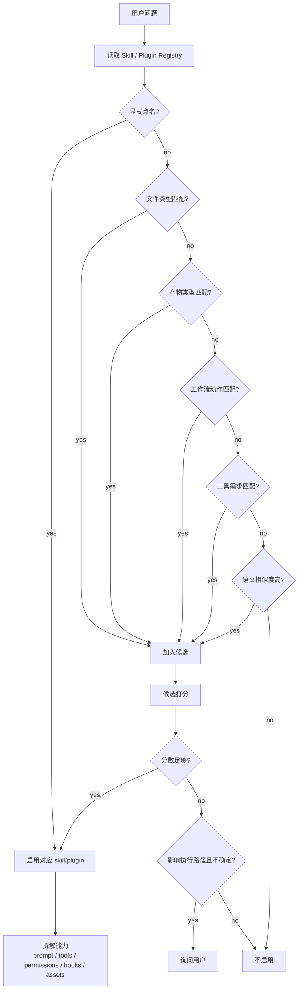
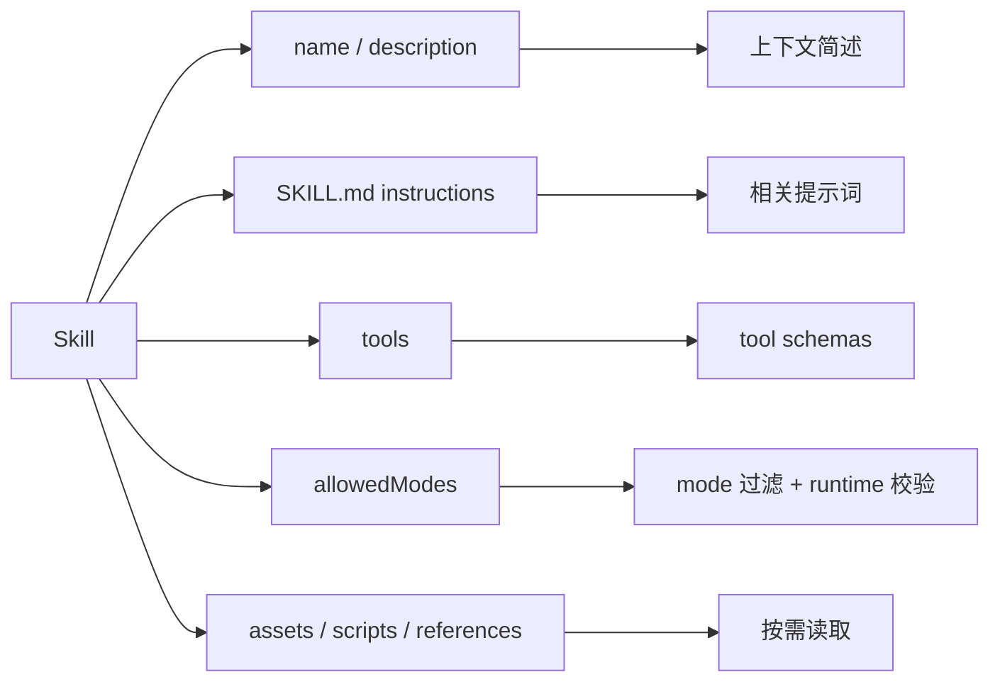
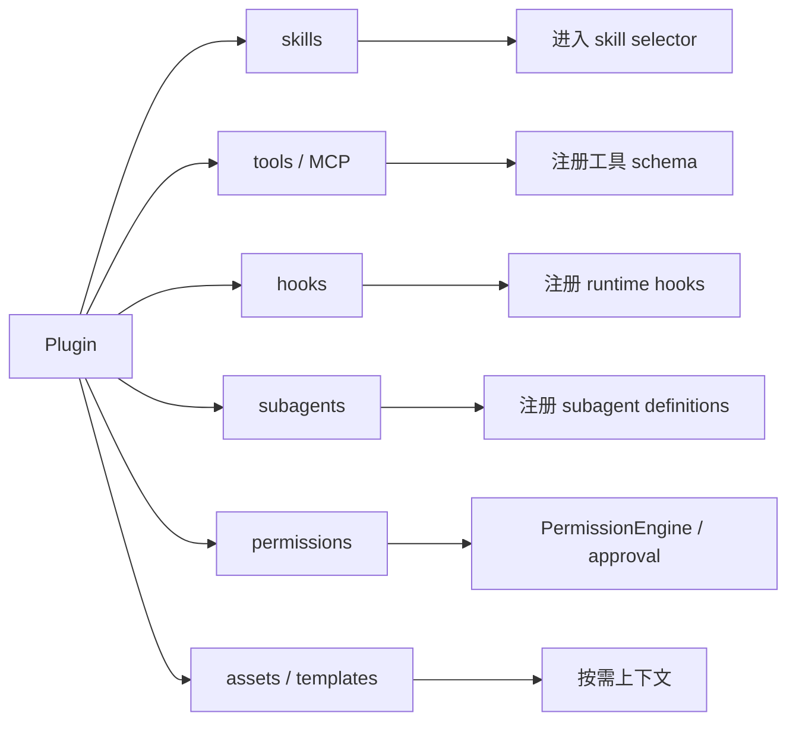

# Skill / Plugin 选择流程

> scope: **capability-selection**  
> 本文说明用户问题进入系统后，如何决定是否启用 skill 或 plugin。

**实现状态**：registry 与加载已在 `@code-mind/capabilities`；`capability-selector.ts` 支持显式/文件类型/工作流/语义（`skill-recall.ts` token cache）/force/confirmed；50–79 分走 `collectPendingSkills` + session 初 `SkillConfirmPrompter`（CAP-01）；高置信注入 snippet，plugin 捆绑与低置信用 index + `read_skill` tool；`allowedTools` 与 `SkillRunPolicy` 已接线。

**Public owner**：`packages/capabilities/src/`（勿在 `packages/core` 内新增 extensions 实现）。

---

## 核心判断

Skill/plugin 不应由模型临场猜测启用，而应由 runtime 的 selector 基于 registry、manifest、用户问题和任务上下文做可审计选择。

## 子系统边界

| 项 | 说明 |
|----|------|
| 什么时候启用 | 每个用户请求进入 `runAgentSession` 前启用；resume/fork 时也应重新核对用户本轮是否显式指定 skill/plugin。 |
| 能做什么 | 读取 registry，召回候选，打分，决定 active skills/plugins/tools/hooks/permissions/assets，并输出启用理由。 |
| 不能做什么 | 不能执行工具，不能读取大文件内容当作上下文，不能直接修改 prompt，不能扩大权限。 |
| 特殊处理 | 低置信但会改变执行路径时询问用户；plugin permission 只能收紧或触发审批，不能默认放宽危险动作。 |



## 触发类型

| 类型 | 触发条件 | 例子 | 处理 |
|------|----------|------|------|
| 显式触发 | 用户直接点名 | “用 browser 打开 localhost” | 必须启用，除非不可用。 |
| 语义触发 | 任务目标匹配能力域 | “做一份 PPT” | 高置信启用。 |
| 工作流触发 | 验收依赖专门流程 | “截图检查布局” | 启用对应工作流。 |

## 推荐打分

```text
explicitNameMatch   +100
fileTypeMatch        +80
productMatch         +70
workflowVerbMatch    +60
toolNeedMatch        +50
semanticSimilarity   +0..40
```

```text
score >= 80     启用
score 50..79    低风险可启用；会改变执行路径时询问用户
score < 50      不启用
```

## Skill 拆解



规则：

- 不要整篇 skill 默认塞进 system。
- 只注入当前任务相关片段。
- 强制工作流可以提升为 system/mode policy。
- allowedModes 必须由 runtime 校验。

## Plugin 拆解



Plugin 是能力包，不是 prompt。启用 plugin 后，要把它提供的能力分发到不同子系统。

## 不应触发

```text
普通代码修改，不需要专门产物或验收流程
只是出现相关词，但不是任务目标
skill 只是可能有帮助
repo-native 实现更合适
当前 mode 不允许该 skill 的关键工具
```

## 输出给后续阶段的数据

selector 输出不应只是一串名字，而应是结构化结果：

```text
SelectedCapabilities
  skills[]
  plugins[]
  toolSchemas[]
  contextBlocks[]
  modePolicies[]
  permissionPolicies[]
  hooks[]
  assets[]
  auditReason[]
```

这些数据会进入 [prompt-assembly.md](./prompt-assembly.md) 和 [tool-loop.md](./tool-loop.md)。
