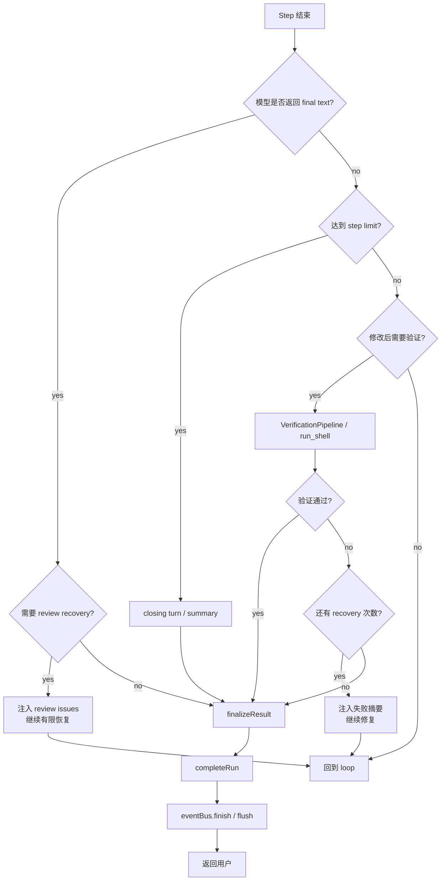
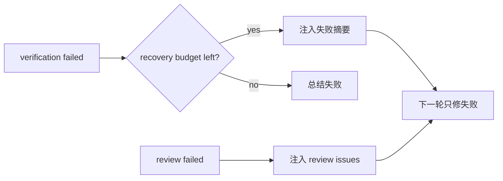
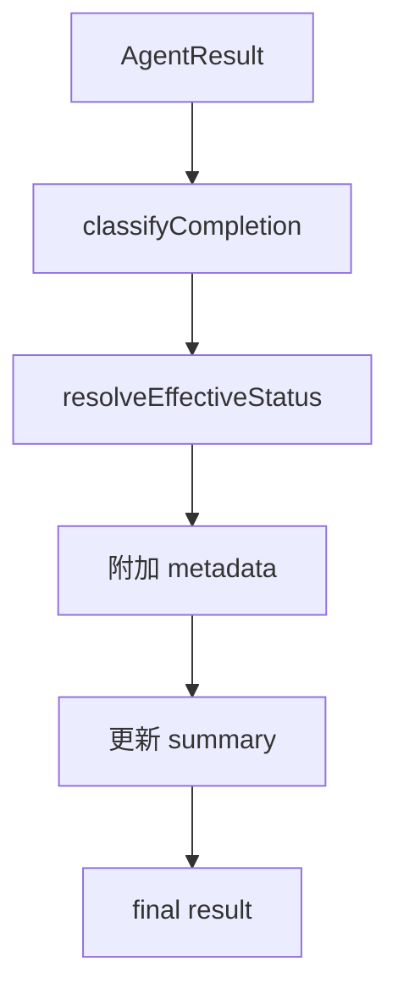

# 结束、验证与 Finalize 流程

> scope: **request-completion**  
> 本文说明 loop 何时停止，如何验证、恢复、finalize，并返回用户结果。

---

## 子系统边界

| 项 | 说明 |
|----|------|
| 什么时候启用 | 模型返回 final text、达到 step budget、用户取消、审批拒绝、权限拒绝、验证/恢复策略要求停止时启用。 |
| 能做什么 | 运行必要 verification/review recovery，计算 completion/effectiveStatus，保存 summary/runState/events，返回用户结果。 |
| 不能做什么 | finalize 阶段不能再执行工具；不能忽略验证失败；不能只用 `result.status` 当产品侧成功判断。 |
| 特殊处理 | 如果主要工作已完成且验证通过，即使 loop 因预算/拒绝软停止，也可能通过 `effectiveStatus` 呈现为成功。 |

## 结束入口



---

## Verification

修改代码后，runtime 应根据 mode/policy 决定是否自动验证。

```text
apply_patch 成功
  -> modifiedFiles += path
  -> 选择相关 test/lint/build/typecheck
  -> 保存 VerificationResult
  -> 更新 runState
```

验证结果：

```text
VerificationResult
  passed
  steps[]
  summary
```

失败摘要进入下一轮上下文，但应截断和聚焦。

## Review / Recovery



恢复策略：

```text
只修当前失败
不要扩大重构范围
保留用户约束
记录 recovery attempt
超过次数后停止
```

## Closing Turn

closing turn 表示 runtime 要求模型停止调用工具并总结。

触发条件：

```text
达到 step budget
ask/plan 模式探索预算用尽
已有足够证据可以总结
修改已验证
验证失败但 recovery 不应继续
用户取消或审批拒绝后需要说明结果
```

closing turn 的模型请求：

```text
tools = []
messages += closing summary instruction
```

## Finalize



completion 分类包括：

```text
diagnosed_only
plan_delivered
verified_only
modified_unverified
modified_verified
verification_failed
review_failed
interrupted_with_findings
incomplete_summary
no_progress
```

`status` 与 `effectiveStatus` 分离：

```text
status          = loop 的事实终止原因
effectiveStatus = 产品侧用户可见结果
```

业务判断应使用：

```text
getEffectiveResultStatus(result)
isAgentRunSuccessful(result)
```

## Session 完成

结束前必须完成：

```text
completeRun
  - 更新 SessionManifest
  - 保存 summary
  - 保存 runState
  - 保存 verification/review/test artifacts

eventBus.finish
  - 发布最终状态
  - flush events

返回用户
  - finalText / summary
  - modifiedFiles
  - verification
  - residual risks / next steps
```

## 结束状态

```text
success
failed
incomplete
stopped_by_limit
permission_denied
user_rejected
cancelled
```

其中 `stopped_by_limit`、`permission_denied`、`user_rejected` 在某些情况下可以通过 `effectiveStatus` 变成用户侧成功。例如：主要修改已经完成且验证通过，但最后一步因为预算或审批停止。
