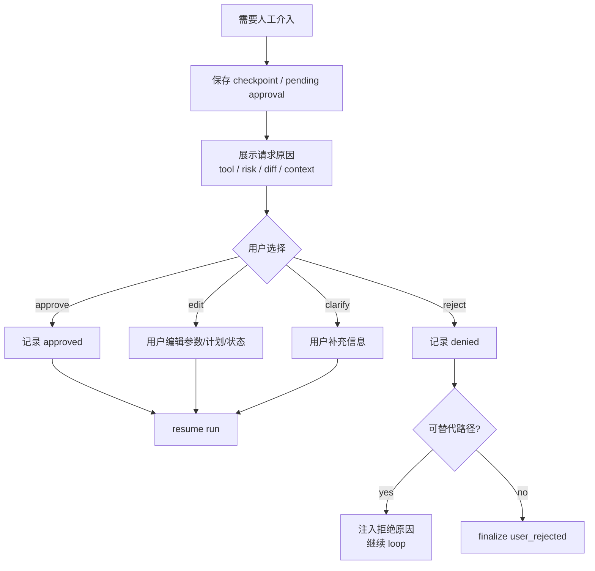

# Human-in-the-loop 流程

> scope: **human-in-the-loop**  
> HITL 不只是最后点一个 approve。它是 interrupt、状态持久化、用户决策和 resume 的闭环。

---

## 子系统边界

| 项 | 说明 |
|----|------|
| 什么时候启用 | 权限 ask、guardrail tripwire、低置信能力选择、缺少必要信息、失败阈值超限、用户显式要求确认时。 |
| 能做什么 | 暂停 run、展示原因和上下文、收集 approve/reject/edit/clarify、保存决策并 resume。 |
| 不能做什么 | 不能丢失中断状态，不能只在最终输出前才审批，不能把用户拒绝当工具成功。 |
| 特殊处理 | resume 必须基于同一个 session/checkpoint；用户编辑状态后要记录 diff 和原因。 |

**实现状态（2026-05）：**

| 能力 | CLI | HTTP API | 说明 |
|------|-----|----------|------|
| approve / reject / always | **已有** | **已有** | `ApprovalCoordinator` / `http-approval-queue` |
| abort（取消 run） | **已有** | **已有** | 打断 tool / plan 审批等待 |
| plan 审批 | **已有** | **已有**（API）；Web UI 面板 **部分** | `http-plan-approval-queue` |
| edit（改参数/计划后继续） | **未实现** | **未实现** | spec 目标形态 |
| clarify（用户补充信息） | **未实现** | **未实现** | spec 目标形态 |
| 独立 guardrails tripwire | **未实现** | **未实现** | MVP 由 PermissionEngine + SafetyGuard 覆盖 |

---

## 总流程



## 触发点

```text
PermissionDecision.ask
Tool guardrail ask/deny
Output guardrail 需要人工审阅
Skill/plugin 低置信但高影响
Plan-first 需要批准计划
危险 shell / package install / git 操作
失败次数超过阈值
模型需要用户补充关键参数
```

## 用户可做的动作

| 动作 | 结果 | 实现 |
|------|------|------|
| approve | 继续原动作。 | **已有** |
| reject | 记录拒绝，模型尝试替代路径或结束。 | **已有** |
| edit | 修改计划、工具参数、目标文件或约束后继续。 | **未实现** |
| clarify | 把用户补充信息作为新上下文进入下一轮。 | **未实现** |
| abort | 取消 run，进入 finalize。 | **已有** |

## 和 prompt 的关系

用户的 HITL 决策会进入下一轮上下文：

```text
approval result
user reason
edited params
new constraints
rejected action
```

但审批本身不靠 prompt 执行，必须由 runtime 暂停和恢复。

## 实现归属建议

```text
packages/server-runtime/src/             # public owner
  http-approval-queue.ts
  http-plan-approval-queue.ts
apps/cli/src/interactive/                # CLI ApprovalCoordinator / permission prompter
apps/api-server/src/routes/approval.routes.ts
apps/api-server/src/routes/plan-approval.routes.ts
packages/core/src/agent/runtime/permission.ts
```

HTTP 审批队列 public owner 为 `@code-mind/server-runtime`；api-server 应 import 该包，core 内不再保留 HTTP 队列实现。
