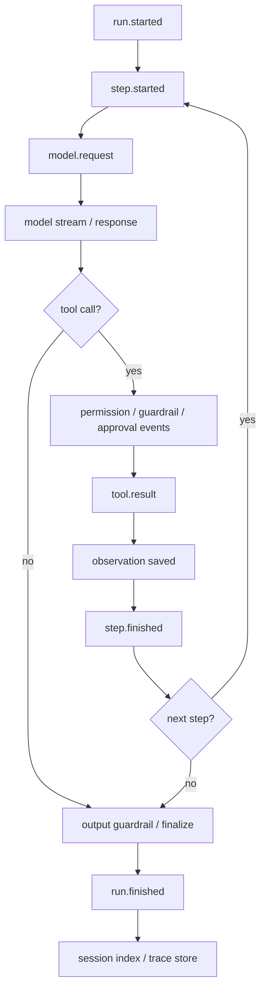
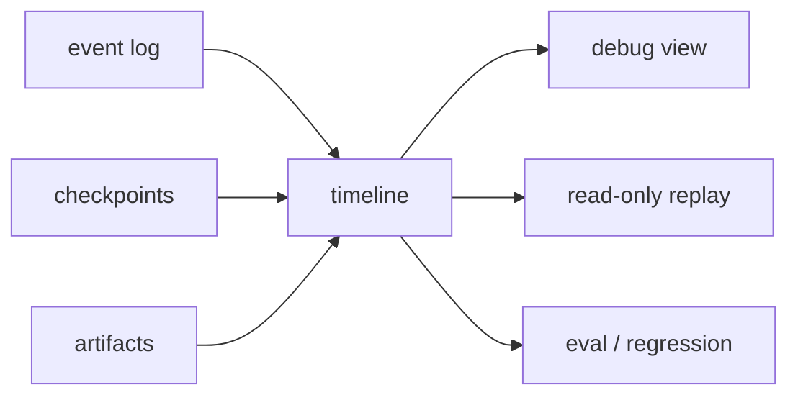

# Observability / Tracing 流程

> scope: **observability**  
> Observability 是全程子系统：记录发生了什么、为什么发生、如何复现、哪里失败、花了多少成本。

**实现状态**：`@code-mind/observability` 已有 event-bus、run-store、redaction 等；kernel phase 通过 `kernel.transition` 事件与 `core.run-kernel` process log 可审计。WebSocket 流式 run 事件在 `packages/core/src/agent/runtime/runtime-event-hub.ts`。replay-engine、完整 cost trace 为 **planned**（P3 增强项，见 [backlog.md](../../backlog.md) 与 [completion-audit.md](../../archive/completion-audit.md) 增强项）。

---

## 子系统边界

| 项 | 说明 |
|----|------|
| 什么时候启用 | 从 run 创建到 final event，全程启用。 |
| 能做什么 | 记录 trace、events、tool I/O 摘要、token/cost、审批、guardrail、checkpoint、失败分类和 replay 数据。 |
| 不能做什么 | 不能泄露密钥、完整敏感输出或未脱敏 prompt；不能影响主流程语义。 |
| 特殊处理 | 支持 redaction、采样、按 run/session 关联、失败后可诊断。 |

## 总流程



## 事件类型

```text
run.started / run.finished
step.started / step.finished
model.request / model.response
model.reasoning.delta / model.content.delta
tool.call / tool.result
permission.decision
approval.requested / approval.resolved
guardrail.tripwire
context.compacted
checkpoint.saved
verification.started / verification.finished
recovery.triggered
kernel.transition
hook.executed
process.log
```

## Redaction

必须脱敏：

```text
API keys
tokens
.env values
private keys
credentials
large raw tool output
user-provided secrets
```

策略：

```text
默认记录摘要
大输出保存 artifact ref
敏感内容只记录 hash/长度/类型
trace export 前二次 redaction
```

## Replay / Debug



Replay 默认不应重新执行副作用工具。需要重放模型或工具时，必须显式进入测试/模拟模式。

## 指标

```text
latency per step
model duration
tool duration
approval wait time
token usage
estimated cost
tool failure rate
verification pass/fail
recovery attempts
guardrail tripwires
```

## 实现归属建议

```text
packages/observability/src/
  event-bus.ts
  run-context.ts
  run-store.ts
  append-run-event.ts
  session-index.ts
  metrics-sink.ts
  redaction.ts

packages/core/src/agent/runtime/kernel-runtime.ts
packages/core/src/agent/runtime/agent-events.ts   # kernelTransitionEvent
```
