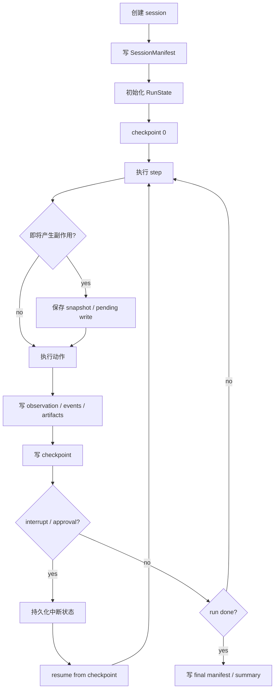
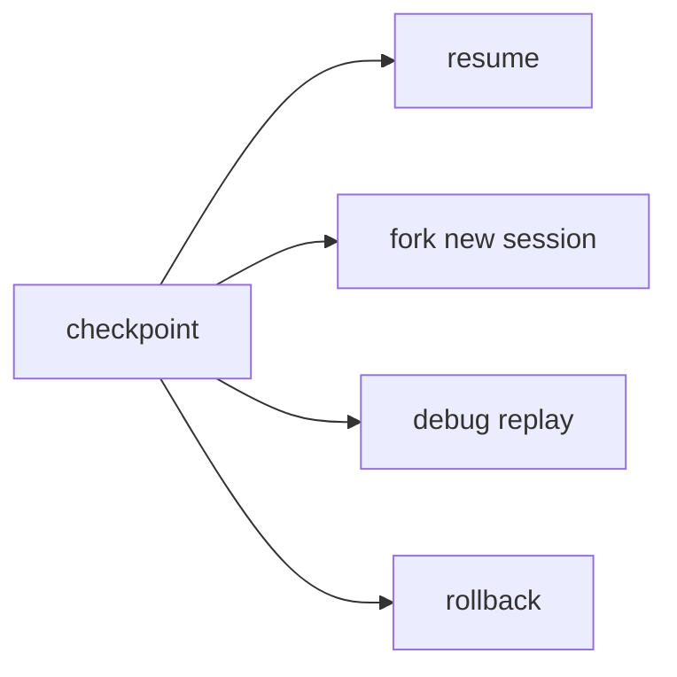

# State Persistence / Checkpoint 流程

> scope: **state-persistence**  
> 状态持久化是 resume、human-in-the-loop、失败恢复、审计和 time travel 的底座。

---

## 子系统边界

**Apps/API** 经 `createOrchestrationSessionStore`（`SessionStorePort`）读写 manifest / approval；**步内 loop** 经 `sessionStoreFactory` → 同一 port adapter（实现：`@code-mind/session` `FileSessionStore`）。

| 项 | 说明 |
|----|------|
| 什么时候启用 | session 创建、每个 step 后、工具副作用前后、approval interrupt 前后、run 结束时。 |
| 能做什么 | 保存 session、runState、manifest、checkpoint、artifacts、pending writes，支持 resume/fork/debug。 |
| 不能做什么 | 不能只依赖内存态，不能在副作用后漏写状态，不能把 checkpoint 当最终成功。 |
| 特殊处理 | 区分 committed state 与 pending writes；approval/resume 必须从同一 checkpoint 继续。 |

## 总流程



## 需要保存什么

```text
SessionManifest
AgentSession messages / observations
RunState
  kernel: RunKernelState
    phase
    step / maxSteps
    closingTurn
    pendingToolCalls
    checkpointRequired
current summary / compacted summary
approval records
verification / review result
patch / diff / snapshot artifacts
tool outputs 或其摘要
event log
token usage
pending writes
```

## Resume / Fork / Time travel



规则：

- resume 继续同一个 session 语义。
- fork 生成新 session，但继承 checkpoint 上下文。
- replay 默认只读，不应重复副作用。
- rollback 必须基于 snapshot/diff，不应猜测文件原始内容。

## Pending writes

工具或 step 失败时，可能出现“部分完成”的状态。需要记录：

```text
planned write
started write
completed write
failed write
rollback available?
artifact path
```

这能让恢复逻辑知道哪些步骤可以跳过，哪些需要补偿或回滚。

## Kernel checkpoint 节点

当前实现中 `RunState` 的 persisted version 为 v4，包含 `kernel`。runtime 在以下 kernel 事件后 checkpoint：

```text
step_started              -> assembling_prompt
prompt_assembled          -> calling_model
model_response_received   -> routing_model_response -> handling_tools | verifying | finalizing
approval_requested        -> awaiting_approval
approval_resolved         -> executing_tool | recovering
recovery_requested        -> recovering (from finalizing, executing_tool, or handling_tools)
tool_calls_handled        -> assembling_prompt | finalizing
run_completed             -> completed
run_cancelled             -> cancelled
run_failed                -> failed
```

完整 `RunKernelPhase` 集合见 `packages/core/src/agent/kernel/state.ts`（含 `executing_tool`、`verifying` 等中间阶段）。

这意味着 approval 中断、模型调用边界、工具完成边界和最终结束状态都可以从 `run-state.json` 直接恢复或审计。新增 loop 阶段时，必须先补 `packages/core/src/agent/kernel/` 的 event/command/invariant 测试，再把 runtime 副作用接到 `runtime/kernel-runtime.ts`。

恢复规则：

- v4 persisted kernel 会被 normalize，不直接信任磁盘字段。
- 非法 `phase`、`step`、`maxSteps`、`pendingToolCalls`、`checkpointRequired` 会回退到由 `progress + budget` 推导出的状态。
- 如果 manifest 记录了更大的 `effectiveMaxSteps`，恢复时同步到 `budget.extraStepBudget` 和 `kernel.maxSteps`。
- runtime 消费 kernel command 时使用 `expectRunKernelCommand()` / `isRunKernelCommand()`，避免多个调用点手写不一致的 command 判断。

## 实现归属建议

```text
packages/core/src/agent/kernel/          # RunKernelState / 纯状态机
packages/core/src/agent/runtime/
  kernel-runtime.ts                      # event / checkpoint / command adapter
  run-state.ts
  run-state-persistence.ts               # v4 kernel 持久化 + normalize

packages/session/src/                    # public owner: @code-mind/session
  session-store.ts
  session-manifest.ts
  session-restore.ts

packages/workspace/src/
  file-snapshot.ts
  diff-manager.ts
  rollback-manager.ts
  session-rollback.ts
```
