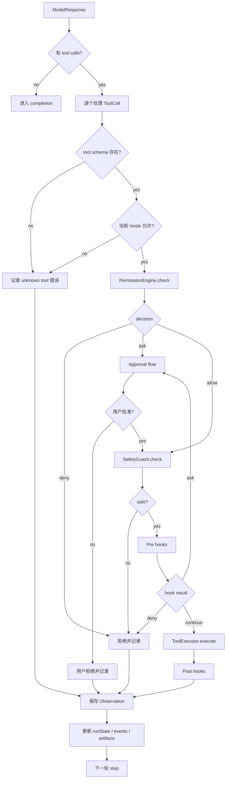
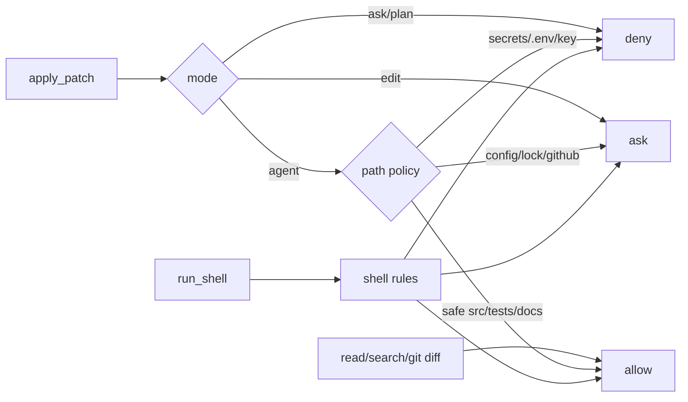
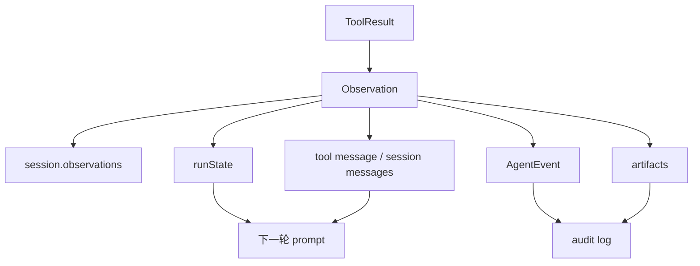

# Tool Loop 流程

> scope: **tool-loop**  
> 本文说明模型返回 tool calls 后，runtime 如何授权、审批、执行工具，并把结果写回下一轮上下文。

---

## 子系统边界

| 项 | 说明 |
|----|------|
| 什么时候启用 | 模型响应包含 `toolCalls` 时启用；没有 tool call 时直接进入 completion。 |
| 能做什么 | 校验工具存在性和 mode 可用性，执行 PermissionEngine、SafetyGuard、approval、hooks，然后调用 ToolExecutor。 |
| 不能做什么 | 不能执行未暴露/未授权工具，不能绕过 approval，不能把失败吞掉，也不能直接把工具结果当成最终答案。 |
| 特殊处理 | 工具失败、拒绝、审批 denial 都要变成 observation；工具输出要截断、脱敏，并进入下一轮上下文。 |

## 总流程



---

## 权限是请求外强制边界

prompt 可以告诉模型“不要做危险操作”，但 runtime 必须在工具执行前强制检查。

```text
model proposes ToolCall
  -> ToolRegistry 是否存在
  -> mode 是否允许
  -> PermissionEngine.check()
  -> SafetyGuard.check()
  -> Approval if needed
  -> Hooks
  -> ToolExecutor.execute()
```

## ToolCall 输入

```text
ToolCall
  id
  name
  arguments
  riskLevel?
  raw?
```

处理时还需要：

```text
ToolContext
  sessionId
  workspaceRoot
  cwd
  mode
  abortSignal
  metadata
```

## Permission 决策



策略归属：

```text
packages/security/src/permissions/permission-engine.ts
packages/security/src/permissions/file-rules.ts
packages/security/src/permissions/shell-rules.ts
packages/security/src/permissions/subagent-permission.ts
```

## Hooks

hooks 是 runtime 行为，不是 prompt。

```text
PreToolUse
PostToolUse
BeforePatchApply
AfterPatchApply
BeforeShellRun
AfterShellRun
ToolError
```

hook 可以：

```text
continue
deny
ask
modify_input
add_context
replace_result
```

修改输入或替换结果必须记录审计事件。

---

## 工具执行

工具实现位于：

```text
packages/execution/src/tools/
```

默认工具（`registerDefaultTools`，见 `default-tools.ts`）包括：

```text
list_dir
read_file
glob
grep
git_status / git_diff / git_log / git_show / git_changed_files / git_restore_file
lsp_diagnostics
worktree_create / worktree_status / worktree_diff / worktree_cleanup
apply_patch
write_file
search_replace
delete_file
move_file
run_shell
```

另由 runtime / composition **动态注册**（不在 `default-tools.ts`）：

```text
enter_plan_mode / exit_plan_mode   # plan-mode-tools.ts；runtime 处理
run_subagent                         # composeAgentLoop；需 model + subagent profile
mcp__{server}__{tool}                # MCP adapter；stdio 连接
```

执行结果：

```text
ToolResult
  success
  output
  data?
  error?
  exitCode?
  artifacts?
  metadata?
```

---

## Observation 回写

工具执行后，结果要同时写入多个地方。



需要更新的状态：

```text
lastTool
lastActivity
toolCounts
modifiedFiles
verification result
review result
approval records
patch/diff artifacts
test results
diagnostics
```

下一轮 prompt 不一定塞完整 tool output。应按相关性、长度、敏感性做截断、摘要或 redaction。

---

## 失败处理

工具失败不是立即结束，而是 observation。

```text
路径不存在
权限拒绝
patch target not found
shell exit code 非 0
test failed
unknown tool
approval denied
hook denied
```

模型下一轮应基于失败继续修正；只有策略明确要求停止，或达到结束条件，才进入 [completion.md](./completion.md)。
