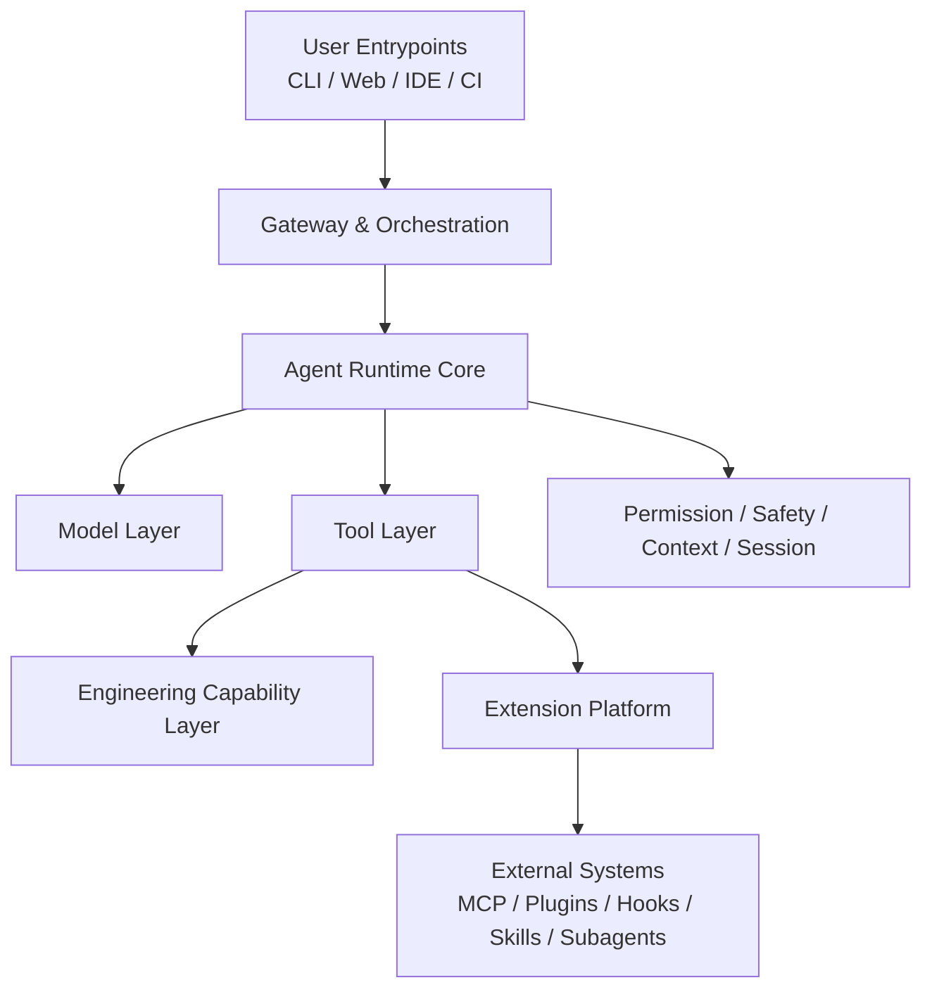

# Code Mind Human Docs

这一部分面向人直接阅读，目标是快速理解 `code-mind` 的正式架构、主数据流和当前实现状态。

推荐阅读顺序：

1. [multi_model_agent_architecture.md](./multi_model_agent_architecture.md)
   唯一正式架构基线，回答“系统是什么”。
2. [system_baseline.md](./system_baseline.md)
   把正式架构落成可执行主干，回答“主数据流如何跑通”。
3. [architecture_alignment_report.md](./architecture_alignment_report.md)
   回答“文档和代码目前对齐到什么程度”。

## Architecture Map

## 文档职责

- `multi_model_agent_architecture.md`
  讲架构边界、层次关系和长期演进方向。
- `system_baseline.md`
  讲主链路、运行原则、MVP 到平台化的承接关系。
- `architecture_alignment_report.md`
  讲当前实现与正式架构的差距，不承担新设计职责。
