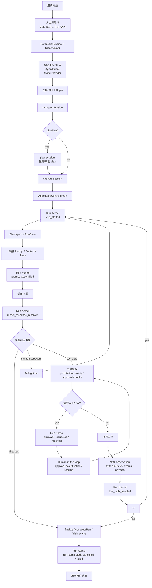
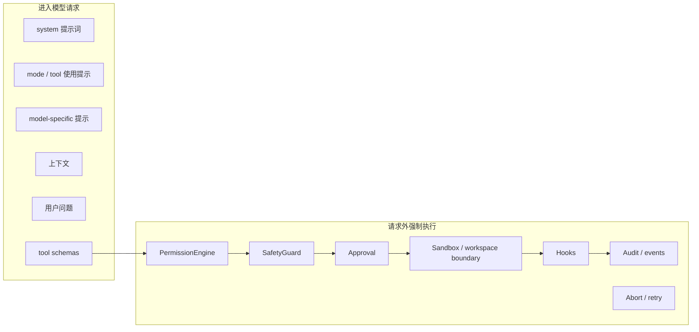

# 请求生命周期流程图

> scope: **request-lifecycle-overview**  
> audience: agent, contributor  
> last updated: 2026-05-30  
> 本目录用流程图说明：用户请求如何进入系统，如何决定启用 skill/plugin，何时拼接 prompt，如何进入 tool loop，最后如何结束。

**包归属以 [core-boundary.md](../core-boundary.md) 为准。** 主流程图中标注 Guardrails 的节点当前由 PermissionEngine + SafetyGuard 覆盖；embedding 召回等为增强项，见各子文档实现状态。

**Loop 分层**：步内 phase 由 Run Kernel 驱动；步间 step 预算与 `LoopPolicy` 由 `AgentLoopController` + `task-strategy` 驱动（双层 FSM，见 [architecture.md §1.8](../architecture.md#18-双层-fsm-与执行分层)）。

---

## 为什么拆成目录

单文件可以写完整，但主流程、skill/plugin 选择、prompt 拼接、tool loop、结束条件放在一起会很快变成一张难维护的大图。这里采用目录结构：

```text
docs/request-lifecycle/
  README.md                  主流程图
  capability-selection.md    skill/plugin 选择与启用
  prompt-assembly.md         prompt / context / tool schema 拼接
  tool-loop.md               模型响应、工具授权、执行和 observation 回写
  completion.md              verification、recovery、finalize 和结束
  state-persistence.md       checkpoint、resume、fork、pending writes
  human-in-the-loop.md       approval、interrupt、clarification、resume
  delegation.md              handoff、subagent、agent-as-tool
  mcp-integration.md         MCP tools/resources/prompts/roots/elicitation/sampling
  observability.md           tracing、events、redaction、eval hooks
```

这样做的好处：

- 主流程图保持可读，适合快速建立全局理解。
- 每个子系统可以独立演进，不需要改一张巨图。
- 文档链接稳定，主流程节点可以跳到对应子系统文件。
- 后续实现 selector、prompt builder、tool authorization 时能直接按文件归属维护。

---

## 主流程图



> Mermaid 的 `click` 支持取决于渲染器。为保证可导航性，下面也提供普通 Markdown 链接。

## 节点链接

| 主流程节点 | 详细文档 | 说明 |
|------------|----------|------|
| 入口校验 | [tool-loop.md](./tool-loop.md) | PermissionEngine、SafetyGuard、审批与 hooks。 |
| 选择 Skill / Plugin | [capability-selection.md](./capability-selection.md) | 显式触发、语义触发、工作流触发、plugin 拆解。 |
| Checkpoint / RunState | [state-persistence.md](./state-persistence.md) | 每步状态保存、resume、fork、pending writes、time travel。 |
| 拼接 Prompt / Context / Tools | [prompt-assembly.md](./prompt-assembly.md) | 5 大类 prompt、上下文来源、tool schema、runtime metadata。 |
| 工具授权与执行 | [tool-loop.md](./tool-loop.md) | tool call 从模型输出到权限、安全、审批、hooks、执行。 |
| Human-in-the-loop | [human-in-the-loop.md](./human-in-the-loop.md) | approval、clarification、interrupt/resume、用户编辑状态。 |
| Delegation / Subagent | [delegation.md](./delegation.md) | handoff、subagent、agent-as-tool、结果合并。 |
| Observation 回写 | [tool-loop.md](./tool-loop.md) | 工具结果如何进入 session、runState、下一轮上下文。 |
| 结束与 finalize | [completion.md](./completion.md) | verification、review、recovery、closing turn、effectiveStatus。 |
| MCP 集成 | [mcp-integration.md](./mcp-integration.md) | MCP tools/resources/prompts/roots/elicitation/sampling 如何映射到 runtime。 |
| Observability | [observability.md](./observability.md) | tracing、events、token/cost、redaction、replay、eval hooks。 |

---

## 子系统启用总表

| 子系统 | 什么时候启用 | 能做什么 | 不能做什么 | 特殊处理 |
|--------|--------------|----------|------------|----------|
| Guardrails | 用户输入进入模型前、每次工具执行前后、最终输出返回用户前。 | 分类、拦截、改写拒绝信息、触发人工介入。 | 不能替代 PermissionEngine，也不能默默执行副作用。 | **[planned, P4+]** 独立 guardrail 子系统尚未实现；当前由 PermissionEngine + SafetyGuard 覆盖 MVP。 |
| Capability Selection | 每个用户请求进入 runtime 前启用；resume 时也应重新核对显式 skill/plugin。 | 选择 skill/plugin/subagent/tool/hook 候选，输出启用理由。 | 不能执行工具，不能修改 prompt 正文，不能绕过权限。 | 结构化 `SelectedCapabilities` + audit reason；见 `@code-mind/capabilities` `capability-selector.ts`。 |
| Prompt Assembly | 每一轮模型调用前启用。 | 组装 system/mode/model/context/user 五大类消息，选择 tool schemas。 | 不能执行权限决策，不能把不可信内容提升成高优先级规则。 | closing turn 和 summary retry 必须传 `tools = []`。 |
| Tool Loop | 只有模型返回 tool calls 时启用。 | 校验工具存在性、mode 可用性、权限、安全、审批、hooks，并执行工具。 | 不能相信 prompt 里的权限摘要，不能直接执行未经授权的工具。 | tool 失败也要作为 observation 回写，不要默认结束。 |
| State Persistence | session 创建、每个 step 后、approval interrupt 前后、run 结束时。 | 保存 checkpoint、runState、manifest、artifacts，支持 resume/fork/debug。 | 不能只依赖内存态，不能在副作用后漏写 checkpoint。 | 需要区分 committed state 与 pending writes。 |
| Human-in-the-loop | 权限 ask、guardrail tripwire、低置信选择、缺少必要信息、失败阈值超限时。 | 暂停、展示原因、收集 approve/reject/edit/clarify，再恢复。 | 不能只在最后做 approve，也不能丢失中断时状态。 | resume 必须基于同一个 session/checkpoint。 |
| Delegation | 任务需要专门 agent、子任务可隔离、用户显式要求 subagent 时。 | handoff、subagent 执行、agent-as-tool、结果合并。 | 不能让子 agent 越权，不能无限递归委派。 | 子 agent 应有独立 session role、tool allowlist 和预算。 |
| Verification / Recovery | 代码被修改后、review 要求再次迭代时、或策略要求验证时启用。 | 运行验证、归纳失败、限制恢复范围、决定是否继续 loop。 | 不能无限恢复，不能扩大到无关重构。 | recovery 次数受 mode policy 控制，失败摘要要截断和聚焦。 |
| MCP Integration | MCP server 连接、能力发现、资源读取、prompt 获取、tool call、elicitation/sampling 时。 | 把 MCP primitives 映射到 tools/context/prompts/HITL/nested model call。 | 不能把所有 MCP 能力都当普通工具，不能忽略 roots。 | resources/prompts 是上下文来源，roots 是边界，elicitation 是 HITL。 |
| Observability | 全程启用。 | 记录 trace、events、tool I/O 摘要、token/cost、失败分类和 replay 数据。 | 不能泄露密钥或完整敏感输出。 | trace 要支持 redaction、采样和按 run/session 关联。 |
| Completion / Finalize | 模型给出 final text、达到预算、用户取消、审批拒绝、验证/恢复终止时启用。 | 计算 completion、effectiveStatus，保存 summary/runState/events，返回用户。 | 不能再执行工具；不能只用 `status` 判断产品成功。 | 使用 `effectiveStatus` 作为用户侧结果判断。 |

子系统应该是有边界的状态机节点，而不是一团可随时互相调用的逻辑。一个小但实用的规则是：**选择能力不执行，拼接 prompt 不授权，工具 loop 不改写策略，finalize 不再行动。**

---

## 总原则

```text
模型上下文：告诉模型应该怎么做
runtime：决定模型能不能做
skill/plugin：能力来源，不是独立 prompt 大类
tool schema：不是自然语言提示词，是 request 的结构化能力声明
权限/安全：必须在请求外强制执行
```

## 请求内与请求外边界



进入 prompt 的权限说明只是摘要，用来减少无效 tool call；真正的权限、安全、审批、sandbox、审计必须在 runtime 外部执行。

## 代码归属

Public owner 路径（新代码应 import 的包）。`packages/core` 内 compat copy 已删除（2026-05-30），见 [core-boundary.md](../core-boundary.md)。

| 职责 | Public owner 路径 |
|------|-------------------|
| Session 入口 | `packages/core/src/agent/run-session.ts` |
| Run kernel / 状态机 | `packages/core/src/agent/kernel/` |
| Kernel runtime adapter | `packages/core/src/agent/runtime/kernel-runtime.ts` |
| Agent loop | `packages/core/src/agent/runtime/agent-loop-controller.ts` |
| 模型请求 | `packages/core/src/agent/runtime/model-step.ts` |
| Context 构建 | `packages/context/src/context-manager.ts` |
| Skill / plugin / subagent | `packages/capabilities/src/`（`skill-engine.ts`, `plugin-manager.ts`, `subagent-*.ts`） |
| Session 持久化 | `packages/session/src/` |
| Verification（CLI/管道） | `packages/verify/src/` |
| HTTP 审批 / 异步 run | `packages/server-runtime/src/` |
| Tool registry | `packages/execution/src/tools/registry.ts` |
| Tool authorization | `packages/core/src/agent/runtime/tool-call/authorization.ts` |
| Permission / safety | `packages/security/src/permissions/`, `packages/security/src/safety/` |
| Tool execution | `packages/execution/src/tool-executor.ts` |
| Observability | `packages/observability/src/` + `packages/core/src/agent/runtime/runtime-event-hub.ts` |
| Finalize/status | `packages/core/src/agent/runtime/finalize.ts`, `packages/core/src/agent/result-status.ts` |
