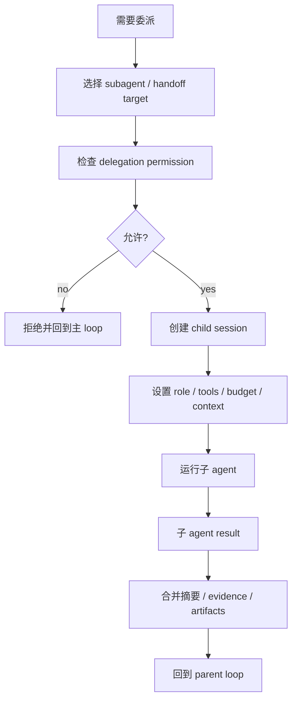

# Delegation / Subagent 流程

> scope: **delegation**  
> Delegation 处理 handoff、subagent、agent-as-tool。它让复杂任务可以委派给专门 agent，但必须保持边界和审计。

---

## 子系统边界

| 项 | 说明 |
|----|------|
| 什么时候启用 | 用户显式要求子代理、任务需要专门能力、子任务可隔离、主 agent 需要探索/计划/审查支持时。 |
| 能做什么 | 选择子 agent，创建子 session，限制工具和预算，执行子任务，合并结果。 |
| 不能做什么 | 不能无限递归委派，不能让子 agent 越权，不能把子 agent 输出当未经验证事实。 |
| 特殊处理 | 子 agent 应有 sessionRole、parentRunId、tool allowlist、maxSteps、result merge 策略。 |

## 总流程



## 三种形态

| 形态 | 用途 | 特点 |
|------|------|------|
| Handoff | 把控制权交给另一个 agent。 | specialist 接管流程，适合领域切换。 |
| Subagent | 父 agent 派发子任务并等待结果。 | 适合探索、计划、审查、并行子任务。 |
| Agent-as-tool | 把 agent 暴露成普通工具。 | 调用简单，但要小心 guardrail/permission 覆盖范围。 |

## 何时不委派

```text
任务很小，单 agent 可完成
子任务需要同样的全部上下文，拆分反而更贵
没有明确验收边界
会导致权限扩大
已有子 agent 正在递归委派
```

## 子 agent 输入

```text
task text
parent session id / run id
role: explore | plan | general
allowed tools
mode
maxSteps
relevant context subset
expected output contract
```

## 子 agent 输出

```text
summary
evidence
files inspected
recommendations
artifacts
verification result
open questions
```

父 agent 合并时要保留来源，不应把子 agent 结论当作未来源标注的事实。

## 实现归属建议

```text
packages/capabilities/src/               # public owner
  subagent-manager.ts
  subagent-tool.ts
  subagent-builtin.ts
packages/security/src/permissions/subagent-permission.ts
packages/core/src/agent/runtime/tool-call/subagent-events.ts
```

Subagent 实现 public owner 为 `@code-mind/capabilities`（`subagent-manager.ts`、`subagent-tool.ts` 等）；勿在 `packages/core` 内新增 subagent 扩展实现。
