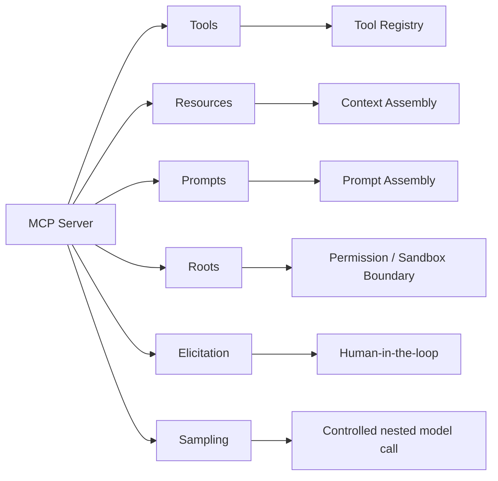
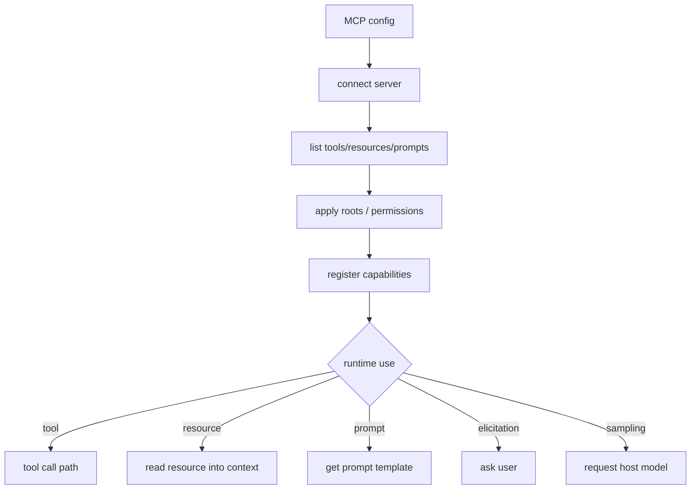

# MCP 集成流程

> scope: **mcp-integration**  
> MCP 不是只有 tools。完整 MCP 集成要处理 tools、resources、prompts、roots、elicitation、sampling。

---

## 子系统边界

| 项 | 说明 |
|----|------|
| 什么时候启用 | MCP server 连接、能力发现、资源读取、prompt 获取、tool call、用户 elicitation、server sampling 时。 |
| 能做什么 | 发现 MCP primitives，把它们映射到 runtime 的 tools/context/prompts/HITL/nested model call。 |
| 不能做什么 | 不能把所有 MCP 能力都当普通工具，不能忽略 roots 和权限边界。 |
| 特殊处理 | resources/prompts 是上下文来源，roots 是访问边界，elicitation 是 HITL，sampling 是受控嵌套模型调用。 |

## MCP primitives 映射



## 连接和发现流程



## 安全要求

```text
MCP tool names must be namespaced
MCP server identity must be visible in audit logs
resources must be treated as untrusted content
prompts must not override system/developer rules
roots must constrain file/resource access
destructive tools require permission policy
elicitation must show the server and reason to the user
sampling must be budgeted and traceable
```

## Prompt 处理

MCP prompt 是模板，不是自动系统指令。

```text
MCP prompt selected by user/runtime
  -> validate args
  -> render template
  -> classify priority
  -> inject as scoped context or task-specific instruction
```

默认不要把 MCP prompt 提升成 system，除非它来自可信内置源且当前任务明确选择。

## 实现归属建议

```text
packages/execution/src/mcp/mcp-adapter.ts
packages/execution/src/tools/registry.ts
packages/context/src/context-manager.ts
packages/security/src/permissions/permission-engine.ts
packages/core/src/agent/runtime/tool-call/authorization.ts
```
